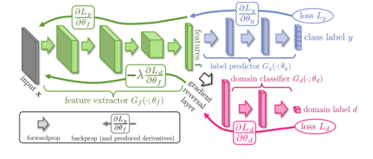
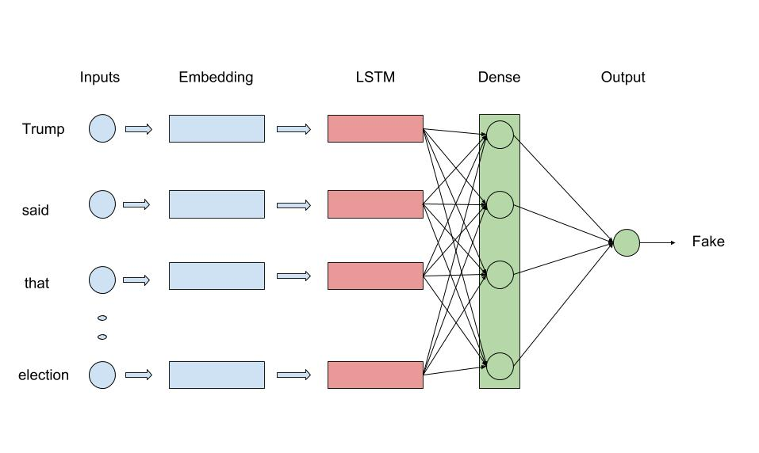
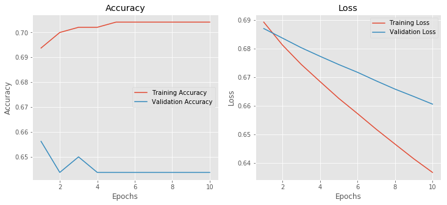

# Fake News Detection

Pranav Nair 201525149 \
Anirudh Kovuru 20161189 \
Nitin Nilesh 20172113 \
Ashish Kumar 201530127 

## Introduction
Fake news detection has recently attracted a growing interest from the general public and researchers as the circulation of misinformation online increases, particularly in media outlets such as social media feeds, news blogs, and online newspapers. For instance, a recent report by the Jumpshot Tech Blog1 found that Facebook referrals accounted for 50% of the total traffic to fake news sites and 20% total traffic to reputable websites. In the field of Fake News Detection, a lot depends on the common features extracted from the corpora. Hence, it’s easy to see why Domain-dependant fake news detection would be a manageable task - since feature learning would be a relatively easy task. However, domain invariant fake news detection would be a significantly more difficult task as it involves learning of features that span over news from multiple domains.

## Datasets
Data scraping (both Real and Fake) was done with Selenium Web Browser Automation. The script written uses Selenium to crawl over all the links present in the url and extract Heading and Data part of it. Sources for the Fake news includes data from fakingnews.com, beforeitsnews.com, worldnewsdailyreport.com and for the Real news bbc.com, news.google.com, news18.com. Five categories of each fake and real news were extracted.The categories includes "India", "Politics", "Entertainment", "Sports", "Technology".

## Model
To properly understand domain invariant fake news detection, we need to first understand how domain specific news detection works. For cases in which you’re only training on dataset from one particular domain, you’d be simply training a labelled classifier, and labels aside, this can be mostly unsupervised. Here, the model would identify the features that separate a fake news article from a news article with credibility. Other metadata like news source and author name could also be thrown in for increased accuracy.   
In other cases, where we deal with multiple domains, the model could be a collection of cascading classifier that could be individually trained to first identify domain and then use the appropriate classifier (based on domain) to classify the news as fake or true. Another approach to this would be to do unsupervised classification over all labelled news articles, without caring about their domain - given a sufficiently large dataset, this would ensure that the factors that define domain are normalised out and the model learns to identify the commonality between all the articles - the possession of characteristics that define them to be fake articles.

However, the approach we’re taking combines aspects of both the approaches given above - the architecture we’re looking at currently involves a deep feature extractor (green) - that can extract features from the text corpus, a deep label predictor (trained to predict an article as fake/true) as well as an unsupervised domain classifier (red) that is trained to predict domains. The feature extractor and label predictor form a generic feed forward network, but the domain classifier is what helps make it domain invariant - it’s connected to the feature extractor via a gradient reversal layer that multiplies the gradient by a certain negative constant during backpropagation in training. The latter is done to minimize the presence of domain specific feature extraction - as the domain classifier aims to decrease its own loss (of domain identification), while the gradient reversal layer ensures that the feature extractor is trying to maximise the same loss.   
This way, features specific to domains are identified and then cancelled out from a set of all features that identify that corpus, hence leaving behind only the label prediction features.   
We have used an LSTM based model by taking GloVe feature vectors for word embedding. We conduct several experiments with different combinations of hyper-parameters. We have used binary cross entropy loss with Adam optimizer setting learning rate as 0.001 with a decay of 0.1. We ran it for 10 epochs with batch size 32. We have used ReLU activation function for LSTM and dense layers. Total 5,801,697 parameters has been trained. Model architecture has shown below.

## Evaluation
We split the dataset into train and validation in the ratio fo 75:25. Finally, we have used 480 samples for training and 160 samples for validation purpose. The performance of the model is shown in figure below

Left figure shows the Accuracy plot and the right figure shows the Loss plot. This graph plotted is for 10 epochs as for further epochs its started overfitting and validation accuracy started decreasing. We got the training accuracy as 70.41% whereas the validation accuracy is 64.37%.

## Conclusion
In this project, we addressed the task of domain invariant fake news detection. We scraped our own data sets from different websites on various domains to gather the data set. We developed classification models based on LSTM that uses GloVe word embeddings. Our best performing models achieved accuracy's that are almost comparable to human ability to spot fake content. However, we have less number of data samples from deep learning models point of view and the news domain was variant in nature, even though we were able to get accuracy which is comparable to human performance.
